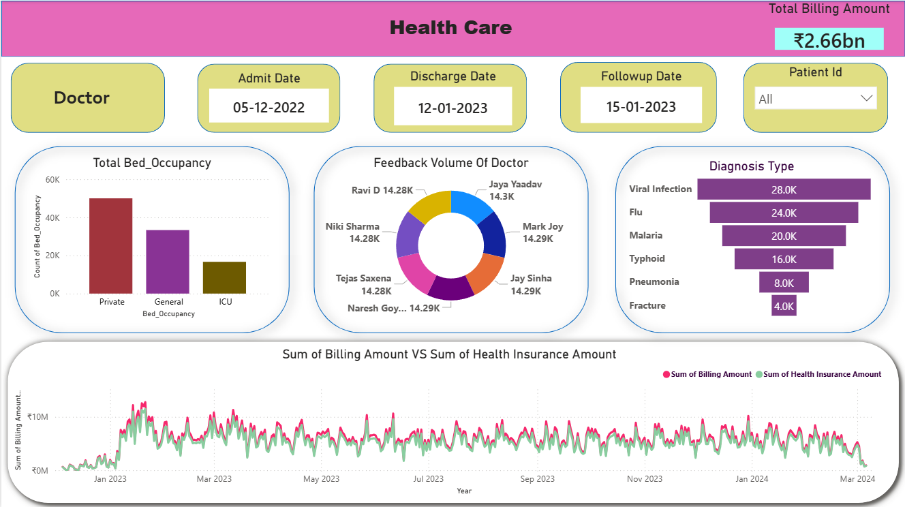

# 🏥 Hospital Operations & Doctor Performance Dashboard

A multi-page Power BI dashboard designed to analyze hospital operations, financial performance, resource utilization, and physician efficiency.

---

## 📊 Project Overview

This dashboard provides insights into:

- Patient flow and admission trends
- Billing vs insurance coverage
- Bed utilization and diagnosis distribution
- Doctor-wise performance metrics

---

## 🧩 Dashboard Features

### 🔹 Multi-Page Architecture
- 2 interactive pages:
  - Overview Dashboard
  - Doctor Performance Dashboard
- Navigation buttons for seamless switching
- 4 slicers:
  - Doctor
  - Disease
  - Date
  - Patient Feedback

---

### 💰 Financial Tracking
- KPIs:
  - Total Billing Amount
  - Insurance Coverage
  - Patient Paid Amount
- Trend Analysis:
  - Billing vs Insurance over time

---

### 🏥 Resource Utilization
- Bed occupancy analysis by type
- Diagnosis distribution using funnel chart
- Helps in hospital capacity planning

---

### 👨‍⚕️ Doctor Performance Analytics
- Patient volume per doctor
- Average Length of Stay (ALOS)
- Revenue generated per doctor
- Patient feedback comparison

---

### 📈 Key Insights
- Identified high-cost patient segments
- Highlighted diagnosis clusters
- Enabled data-driven decision making for hospital management

---

## 🖼️ Dashboard Preview

### Overview Page

### Doctor Performance Page

---

## 🛠️ Tools & Technologies

- Power BI
- DAX (Data Analysis Expressions)
- Data Modeling
- Healthcare Analytics

---

## 🚀 How to Use

1. Download the `.pbix` file
2. Open in Power BI Desktop
3. Interact using slicers and filters

Your Name  
MCA Student | Aspiring Data Analyst / Software Developer
